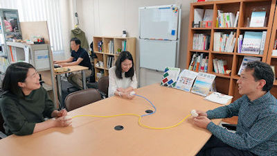

# 「 空気伝話 」ってなに？
　「**空気伝話**」は、**ゴムボール**とそれらをつなぐ**チューブ**からなる、**触覚による情報伝達装置**です。  
一人ずつそれぞれのボールを手にしてもらい、**ボールを握る**とボール内の空気がチューブを通って移動し、他のひとの**ボールが膨らむ**という単純なもの。  

これが、ボールの**握り方**によって、相手の手の中へ伝わる**感触**[（動画）](movie/movie1.mp4)  が変わります。  
 使ってみると、思わず“**笑み**”がこぼれてしまう「空気伝話」。  
 
　これまで、目の不自由な方のサッカー観戦や心療内科、幼児と母親間で使用してもらい、不思議な感触や、躍動感のやり取り、雰囲気の緩和効果などを体験してもらっています。　　

# 事例やアンケート結果  
 ・NTTインターコミュニケーション・センター (ICC)での[展示](https://www.ntticc.or.jp/ja/exhibitions/2019/social-haptics-lab/) （東京2019.5.18—2020.3.1)  
 ・ブラインドサッカーにおける視覚障がい者の観戦  
 ・心療内科のグループカウンセリングでの[アンケート結果](image/questionnaire2.jpg) 　　

# その様子や利用イメージ  
・[コンセプトイメージ（ウィズコロナ）](image/air_handshaker.jpg)  

# 使ってみたい、という方へ
下記の連絡先までご相談ください。  

体験のご希望：北海道立総合研究機構　工業試験場　桒野（くわの）  
Email: <kuwano-kouki@hro.or.jp>
Tel:011-747-2975 Fax:011-726-4057

購入のご希望：株式会社オブシープ　吉田  
Email: <yoshida@ofsheep.com>
Tel: 080-3356-3646
